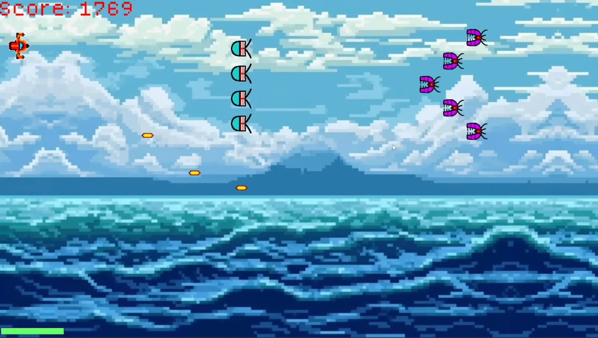
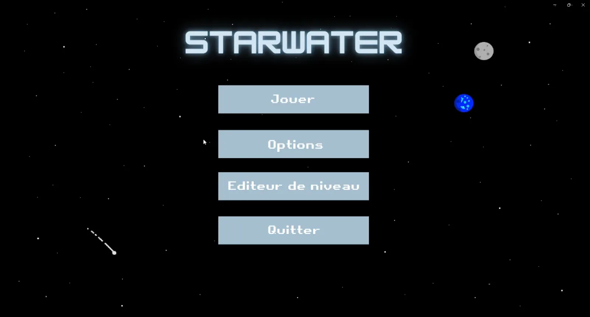
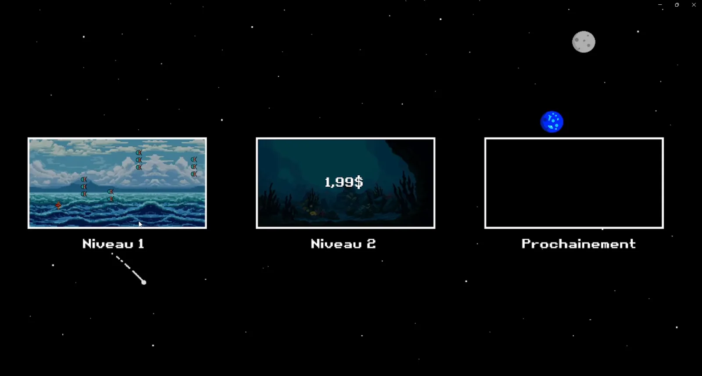
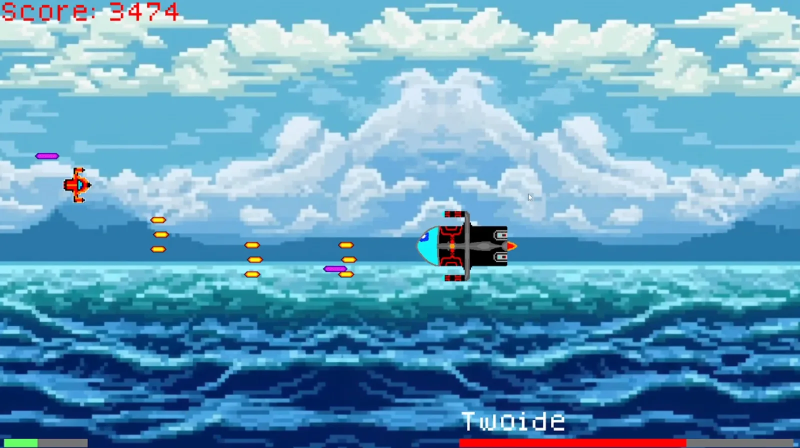

# 🌊✨ StarWater - 2D Shoot'em Up

*Protect 4546B, an ocean planet threatened by space pirates, and find out what they're really after there.*

🕹️ [Play on itch.io](https://dracolich5.itch.io/starwater) · 🎥 [Gameplay video](https://youtu.be/pVnomQXyplI)

---

## 📸 Screenshots

  
  

  
  

*(more screenshots in the [`screenshots/`](./screenshots) folder)*

---

## 🎮 Overview

An auto-scrolling side-scrolling shoot'em up. The player destroys waves of enemies and dodges projectiles to advance, with a bonus selection system between each wave and a boss battle at the end of each level.

Made in 3 weeks (December 2024) by [Léa Pavel](https://github.com/LeaPav) & [Kiliann Pommez](https://github.com/KPommez).

---

## ✨ Key Features

- 8-direction movement
- Automatic primary fire + secondary fire based on power-ups
- Health system
- Scoring with multipliers
- Choose one of three bonuses at the end of each wave
- Weapon power-ups: rapid fire, double shot, triple shot, diagonal triple shot
- Defensive power-ups: shield, healing, enemy fire slowdown, offensive shield
- 3 difficulty modes: Normal, Hard, Hardcore
- Built-in level editor

---

## 🕹️ Controls

| Action | Key |
|---|---|
| Move | `Z` `Q` `S` `D` |
| Shoot | `Space` |

---

## 🧩 Role Split
 
Work was shared between the two of us without a strict division of roles.
 
**Léa Pavel:**
- Core player gameplay (movement, shooting)
- Game menus
- Bonus system
- Level editor
  
**Kiliann Pommez:**
- Enemies & Boss (including projectile logic)
- Parallax background
- Asset design
- Sound design

## ⚠️ Known Limitations

Development time was limited, especially near the end of the project - the level editor could not be fully finalized.

---

## 🛠️ Built With

 
